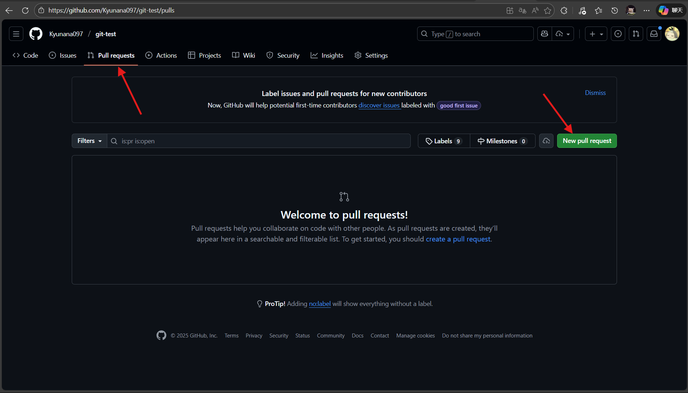

# git-test🎯 Git基础作业

## 📋 作业要求

完成以下4个任务，掌握Git基础操作：

### ✅ 任务1：在VSCode中安装配置Git（Windows）

教程：[Windows+VScode配置与使用git，超详细教程，赶紧收藏吧_vscode git-CSDN博客](https://blog.csdn.net/czjl6886/article/details/122129576)

**步骤详解：**

1. **下载Git**
	- 访问官网：https://git-scm.com/download/win
	- 点击"64-bit Git for Windows Setup"下载
	- 或者使用镜像站：https://npm.taobao.org/mirrors/git-for-windows/
2. **安装Git**
	- 双击下载的安装包
	- **重要选项设置**：
		- 选择安装路径（默认即可）
		- 选择组件：保持默认勾选
		- 选择编辑器：选择"Use Visual Studio Code as Git's default editor"
		- 调整PATH环境：选择"Git from the command line and also from 3rd-party software"
		- HTTPS传输：选择"Use the OpenSSL library"
		- 行结束转换：选择"Checkout Windows-style, commit Unix-style line endings"
		- 终端模拟器：选择"Use MinTTY"
	- 点击Install完成安装

3. 打开拓展界面 搜索并安装需要的包（git、python、markdown）
   
4. 配置Git
   
   - 在VSCode终端中输入：
   ```bash
   git config --global user.name "你的GitHub用户名"
   git config --global user.email "你的GitHub邮箱"
   git config --global init.defaultBranch main
   ```

### ✅ 任务2：使用SSH连接到GitHub

教程：[Github配置ssh key的步骤（大白话+包含原理解释）_github生成ssh key-CSDN博客](https://blog.csdn.net/weixin_42310154/article/details/118340458)

**详细步骤：**

1. **生成SSH密钥**
   
   - 在VSCode终端中输入：
   ```bash
   ssh-keygen -t ed25519 -C "你的GitHub邮箱"
   ```
   - 按回车键接受默认文件位置
   - 输入密码（一直回车即可）
   
2. **启动SSH代理**（可选）
   
   - 在VSCode终端中输入：
   ```bash
   # 启动ssh-agent
   eval $(ssh-agent -s)
   
   # 添加SSH密钥
   ssh-add ~/.ssh/id_ed25519
   ```
   
3. **复制公钥**
   
   - 在VSCode终端中输入：
   ```bash
   cat ~/.ssh/id_ed25519.pub
   ```
   - 选中并复制显示的所有内容（以ssh-ed25519开头）
   
4. **添加到GitHub**
   - 登录GitHub网站
   - 点击右上角头像 → Settings
   - 左侧菜单选择"SSH and GPG keys"
   - 点击绿色按钮"New SSH key"
   - Title输入：My Computer
   - Key类型选择：Authentication Key
   - 将复制的公钥粘贴到Key框中
   - 点击"Add SSH key"

5. **测试连接**
   - 在VSCode终端输入：
   ```bash
   ssh -T git@github.com
   ```
   - 看到"Hi 用户名! You've successfully authenticated"说明成功

### ✅ 任务3：分支操作和文件管理

教程：[Git 五分钟教程 | 菜鸟教程](https://www.runoob.com/w3cnote/git-five-minutes-tutorial.html)

**完整操作流程：**

1. **Fork本仓库**
   - 打开本仓库页面
   - 点击右上角的"Fork"按钮
   - 选择你的账号，点击"Create fork"

2. **克隆到本地**
   - 在你的Fork页面，点击绿色的"Code"按钮
   - 选择SSH，复制地址（类似：git@github.com:你的用户名/git-learning-lab.git）
   - 在VSCode中：
     - 按 `Ctrl + Shift + P` 打开命令面板
     - 输入"Git: Clone"并选择
     - 粘贴仓库地址，选择保存位置

3. **创建新分支**
   - 在VSCode中：
     - 点击左侧活动栏的源代码管理图标（或按 `Ctrl + Shift + G`）
     - 点击左下角的当前分支名（通常是main）
     - 选择"创建新分支"
     - 输入分支名：`你的GitHub用户名`’s feature
     - 按回车确认

4. **创建个人文档**
   - 在VSCode资源管理器中：
     - 右键点击仓库根目录
     - 选择"新建文件"
     - 文件名：`你的GitHub用户名.md`（例如：zhangsan.md）
   - 在文件中写入内容（示例）：
   ```markdown
   # 我的Git学习档案
   
   ## 基本信息
   - 姓名：张三
   - GitHub用户名：zhangsan
   - 学习日期：2024年X月X日
   
   ## 学习心得
   oiiaioiiiai
   ```
   
5. **使用VSCode Git插件提交**
   
   - **添加到暂存区(git add)**：
     - 在源代码管理面板中
     - 找到你创建的.md文件
     - 点击文件右侧的"+"号（鼠标悬停显示"暂存更改"）
     - 或者右键文件选择"暂存更改"
   
   - **提交更改(git commit)**：
     
     - 在"消息"框中输入提交信息（可使用AI生成）：
     ```
     添加个人学习档案 - 你的GitHub用户名
     ```
     - 点击上方的对勾图标（✓）或按 `Ctrl + Enter`
     - 如果提示配置Git，按指引操作即可
   
6. **推送到远程仓库**
   - 点击源代码管理面板的"..."菜单
   - 选择"推送到"
   - 选择"origin"和你的分支名
   - 如果是首次推送，会提示发布分支，点击"确定"

### ✅ 任务4：提交Pull Request

教程：[如何在 Github 上规范的提交 PR（图文详解） - 知乎](https://zhuanlan.zhihu.com/p/584834288)

**详细步骤：**

1. **准备推送**
   - 确保所有更改都已提交
   - 在VSCode终端中确认状态：
   ```bash
   git status
   ```
   - 应该显示"working tree clean"

2. **推送到GitHub**
   - 在VSCode中：
     - 点击左下角的同步按钮（循环箭头图标）
     - 或者点击"..."菜单 → "推送到" → 选择origin

3. **创建Pull Request**
   - 打开浏览器，进入你的Fork仓库页面
   - 你会看到"Compare & pull request"按钮，点击它
   - 或者在主仓库页面点击"New pull request"
   - PR标题填写：`添加 你的GitHub用户名 的学习档案`（想写什么都可以 保证维护者能一眼看出这个PR的内容是什么）
   - PR内容填写（可选）：
   ```markdown
   ## 作业提交
   
   - [x] 完成任务1：Git安装配置
   - [x] 完成任务2：SSH连接配置  
   - [x] 完成任务3：创建分支和文档
   - [x] 完成任务4：提交PR
   
   这是我的Git基础作业，请查收！
   ```

4. **提交PR**
   
   - 检查更改文件是否正确（应该只有你的.md文件）
   - 点击"Create pull request"按钮
   - 等待仓库维护者审核合并

## 📸 操作截图参考

### github界面说明



## ⚠️ 常见问题解决

### Git未找到命令
- 重启VSCode
- 检查Git是否正确安装：`where git`

### SSH连接失败
- 检查密钥是否正确添加到GitHub
- 确保使用了正确的邮箱地址

### 推送失败
- 先执行拉取：`git pull origin main`
- 检查是否有冲突需要解决

### 分支创建失败
- 确保当前在正确的分支上
- 检查分支名是否包含特殊字符

## 🎯 完成标准

- [ ] 成功安装Git并配置用户信息
- [ ] SSH连接测试成功
- [ ] 创建了个人分支
- [ ] 创建了个人markdown文档
- [ ] 使用VSCode成功提交更改
- [ ] 成功创建Pull Request

## 📞 需要帮助？

如果在完成作业过程中遇到问题：
1. 查看[Git官方文档](https://git-scm.com/doc)
2. 向聪明的AI提问
3. 联系老登寻求帮助
